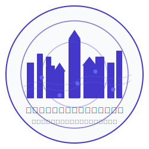

# グローバル・ハーモニー・シティ IT構想

<p align="center">
  
</p>

<p align="center">
  <em>人と技術が共鳴する持続可能な未来都市</em>
</p>

<p align="center">
  <a href="#ビジョン">ビジョン</a> •
  <a href="#プロジェクト概要">プロジェクト概要</a> •
  <a href="#アーキテクチャ">アーキテクチャ</a> •
  <a href="#技術スタック">技術スタック</a> •
  <a href="#始め方">始め方</a> •
  <a href="#貢献方法">貢献方法</a> •
  <a href="#ロードマップ">ロードマップ</a> •
  <a href="#チーム">チーム</a>
</p>

## ビジョン

グローバル・ハーモニー・シティは、日本の伝統的な「和」の精神と最先端テクノロジーを融合させた新たな自治体モデルです。私たちは単なる「スマートシティ」ではなく、「人間中心のインテリジェント・コミュニティ」を目指しています。

> 「テクノロジーは目的ではなく、人々の幸福と社会の持続可能性を高めるための手段である」

このビジョンを実現するため、私たちは5つの核となる価値観を大切にしています：

- **人間中心の技術発展**: テクノロジーは常に人間の幸福と生活の質向上のために存在します
- **調和のとれた共存**: 多様性を尊重しながらも強いコミュニティ意識を育みます
- **持続可能な豊かさ**: 経済成長と環境保全の両立を図ります
- **創造的問題解決**: 常に革新的思考で社会課題に取り組みます
- **世代を超えた継承**: 現在の繁栄を未来へと橋渡しする長期的視点を持ちます

## プロジェクト概要

このリポジトリでは、グローバル・ハーモニー・シティのIT基盤構築プロジェクトを進めています。初期フェーズでは、Microsoft製品エコシステムを活用した効率的かつスケーラブルなシステム構築に取り組んでいます。

特徴：

- **Microsoft 365とAzureを活用した統合環境**: クラウドネイティブな自治体システム
- **少人数チームでの最大限の効率化**: Power Platformの活用による効率的な開発
- **段階的成長に対応するスケーラブルなアーキテクチャ**: 小規模スタートから徐々に拡張
- **住民参加型の開発プロセス**: フィードバックを取り入れながらの継続的改善
- **オープンソース**: 知見の共有と外部協力者を歓迎

## アーキテクチャ

グローバル・ハーモニー・シティのITシステムは、Microsoft製品を中心とした4層アーキテクチャで構成されています：


### 主要コンポーネント

1. **住民タッチポイント層**
   - SharePointベースのWebポータル
   - Power Appsモバイルアプリケーション
   - Microsoft Teamsコミュニティハブ

2. **アプリケーション層**
   - コンテンツ管理基盤
   - コミュニケーション基盤
   - 業務自動化基盤
   - 認証・ID管理

3. **データ層**
   - 構造化データ (Dataverse)
   - コンテンツデータ (SharePoint)
   - 分析データ (Power BI)

4. **インフラ層**
   - Microsoft 365
   - Microsoft Azure

詳細は[技術設計ドキュメント](docs/technical-design.md)をご参照ください。

## 技術スタック

### フロントエンド
- SharePoint Online (ポータルサイト)
- Power Apps (住民向けモバイルアプリ)
- Microsoft Teams (コミュニティプラットフォーム)
- SharePoint Framework (SPFx) (UI拡張)

### バックエンド
- Power Automate (ワークフロー自動化)
- Azure Functions (サーバーレスコンピューティング)
- Microsoft Graph API (統合連携)

### データ管理
- Microsoft Dataverse (構造化データ)
- SharePoint リスト/ライブラリ (コンテンツ管理)
- Azure SQL Database (関係データベース)
- Power BI (データ分析・可視化)

### セキュリティ
- Microsoft Entra ID (旧 Azure AD) (ID管理)
- Microsoft Purview (コンプライアンス)
- Microsoft Defender (セキュリティ)

## 始め方

このプロジェクトに参加するための手順は以下の通りです：

### 前提条件
- Microsoft 365 開発者アカウント または Microsoft 365 E3/E5 ライセンス
- Power Platform 開発者環境
- GitHub アカウント

### インストール手順
1. リポジトリのクローン
   ```bash
   git clone https://github.com/global-harmony-city/smart-city-project.git
   cd smart-city-project
   ```

2. 開発環境のセットアップ
   ```bash
   # 環境設定スクリプトの実行（準備中）
   ./scripts/setup-dev-environment.ps1
   ```

3. 設定ファイルの構成
   ```bash
   # 例：SharePoint設定の構成（準備中）
   cp config/sharepoint-template.json config/sharepoint.json
   # 設定ファイルを編集して必要な情報を入力
   ```

詳細な手順と最新情報は[開発者ガイド](docs/developer-Guide.md)をご参照ください。

## 貢献方法

グローバル・ハーモニー・シティプロジェクトへの貢献を歓迎します！以下の方法で参加いただけます：

- **コード貢献**: Pull Requestでのコード提供
- **テスト・フィードバック**: 機能のテストとフィードバック提供
- **ドキュメント改善**: ドキュメントの翻訳や改善提案
- **アイデア提案**: Discussionsでの新機能や改善アイデアの提案

詳しくは[貢献ガイドライン](CONTRIBUTING.md)をご覧ください。

## ロードマップ

プロジェクトは4つのフェーズで段階的に進行します：

### フェーズ1: 基盤構築期 (現在進行中)
- Microsoft 365 環境の初期構築
- SharePoint ポータルサイト開発
- Power Apps 住民向けモバイルアプリ開発
- 基本認証・認可システムの構築

### フェーズ2: 初期成長期 (予定)
- 各機能の拡充と専門化
- 自動化ワークフローの拡充
- データ分析基盤の構築
- API連携の拡大

### フェーズ3: 拡大期 (予定)
- 外部システム連携の拡充
- AI活用の高度化
- IoTセンサー統合
- マルチプラットフォーム対応

### フェーズ4: 成熟期 (予定)
- 完全自動化運用
- デジタルツイン連携
- 先進的サービスの実装
- 他自治体への展開モデル確立

詳細なロードマップは[プロジェクトボード](https://github.com/orgs/global-harmony-city/projects/1)で管理しています。

## チーム

現在、本プロジェクトは2名体制で運営しています：

- **技術責任者** - 実装・開発担当
- **Claude** - 設計・コンテンツ支援

新たなチームメンバーを随時募集中です。[Discussions](https://github.com/global-harmony-city/smart-city-project/discussions)で募集情報を確認してください。

グローバル・ハーモニー・シティのREADMEファイルを拡張して、組織全体図や機能マップ情報を追加します。以下に、既存のREADMEに追加する内容を提案します。

## ライセンス

このプロジェクトは[MITライセンス](LICENSE)の下で公開されています。

## 補足資料

グローバル・ハーモニー・シティ構想の詳細理解のため、以下の補足資料を提供しています。これらの図表は、プロジェクトの全体像と各機能の関連性を視覚的に表現したものです。

### 組織構成と機能マップ

以下のSVGファイルでは、自治体の組織構造や各機能の詳細を確認できます：

1. **自治体職員向け組織構成図**  
   [`docs/assets/organization/org-structure.svg`](docs/assets/organization/org-structure.svg)  
   120名の最小実行チームによる8つの機能部門の構成と役割を示しています。

2. **各機能部門の詳細ビジュアルガイド**
   - 統治・行政機能: [`docs/assets/functional-maps/governance-admin.svg`](docs/assets/functional-maps/governance-admin.svg)
   - インフラ・公共サービス: [`docs/assets/functional-maps/infra-public-services.svg`](docs/assets/functional-maps/infra-public-services.svg)
   - 経済基盤: [`docs/assets/functional-maps/economic-foundation.svg`](docs/assets/functional-maps/economic-foundation.svg)
   - 教育・人材育成: [`docs/assets/functional-maps/education-hr.svg`](docs/assets/functional-maps/education-hr.svg)
   - 医療・健康: [`docs/assets/functional-maps/healthcare.svg`](docs/assets/functional-maps/healthcare.svg)
   - コミュニティ・文化: [`docs/assets/functional-maps/community-culture.svg`](docs/assets/functional-maps/community-culture.svg)
   - 安全・セキュリティ: [`docs/assets/functional-maps/safety-security.svg`](docs/assets/functional-maps/safety-security.svg)
   - テクノロジー基盤: [`docs/assets/functional-maps/tech-foundation.svg`](docs/assets/functional-maps/tech-foundation.svg)

3. **IT構成図**
   - ITシステムアーキテクチャ: [`docs/assets/it-architecture/system-architecture.svg`](docs/assets/it-architecture/system-architecture.svg)
   - Microsoft製品エコシステム構成: [`docs/assets/it-architecture/ms-ecosystem.svg`](docs/assets/it-architecture/ms-ecosystem.svg)

### 歴史的リーダーシップモデル

各機能部門は歴史上の著名なリーダーのリーダーシップスタイルを参考にしています。詳細は [`docs/leadership-models.md`](docs/leadership-models.md) を参照してください。

---

<p align="center">
  <sub>グローバル・ハーモニー・シティ © 2025 All Rights Reserved</sub>
</p>
