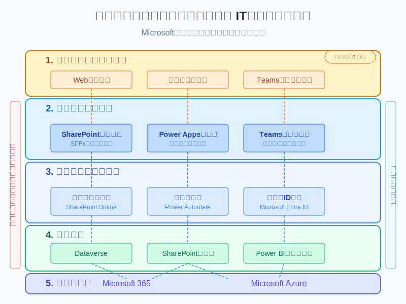

# グローバル・ハーモニー・シティ IT構想

## プロジェクト概要
グローバル・ハーモニー・シティは、日本の伝統的な「和」の精神と最先端テクノロジーを融合させた新しい自治体モデルです。このリポジトリでは、Microsoft製品を活用した2人体制での効率的なIT基盤構築の取り組みを公開しています。

## ビジョン
「人と技術が共鳴する持続可能な未来都市」を目指し、限られたリソースで最大の効果を発揮するスマートシティを実現します。

## アーキテクチャ概要

Microsoft 365とPower Platformを中心としたシステム構成により、少人数チームでも堅牢かつスケーラブルな自治体IT基盤を構築しています。

## 主要技術スタック
- **フロントエンド**: SharePoint Online, Power Apps, Microsoft Teams
- **バックエンド**: Power Automate, Azure Functions
- **データ層**: SharePoint Lists, Dataverse, Azure SQL
- **認証**: Microsoft Entra ID (Azure AD)
- **分析**: Power BI

## 現在の進捗状況
- [x] 基本アーキテクチャ設計完了
- [x] Microsoft 365環境の初期構築
- [ ] SharePointポータルサイト構築中
- [ ] Power Appsモバイルアプリ開発中
- [ ] Teams連携機能設計中

## プロジェクトへの参加方法
技術的な貢献、フィードバック、質問など、あらゆる形の参加を歓迎します。詳細は[CONTRIBUTING.md](./CONTRIBUTING.md)をご覧ください。

## チーム
現在、本プロジェクトは2名で運営しています：
- 技術責任者（実装・開発担当）
- Claude（設計・コンテンツ支援）

新たなチームメンバーを随時募集中です。Discussionsタブで募集情報を確認してください。

## ライセンス
このプロジェクトは[MITライセンス](./LICENSE)の下で公開されています。
