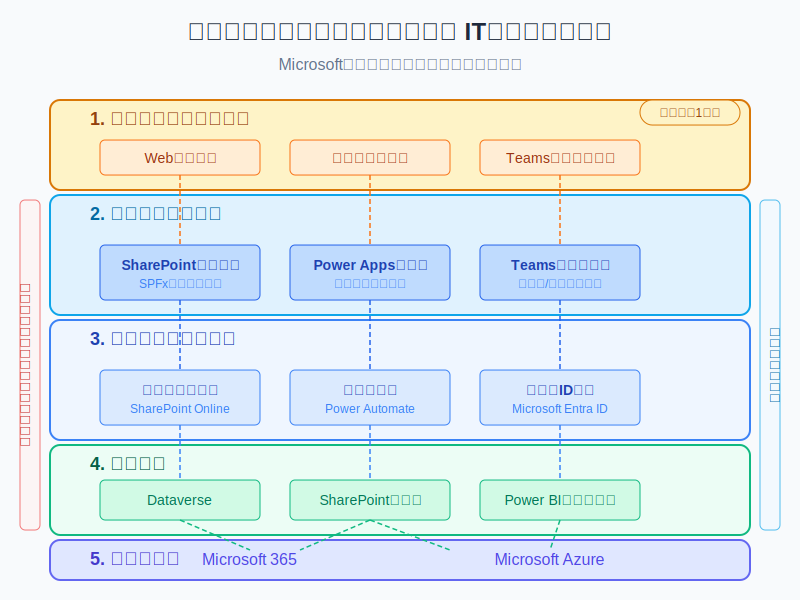
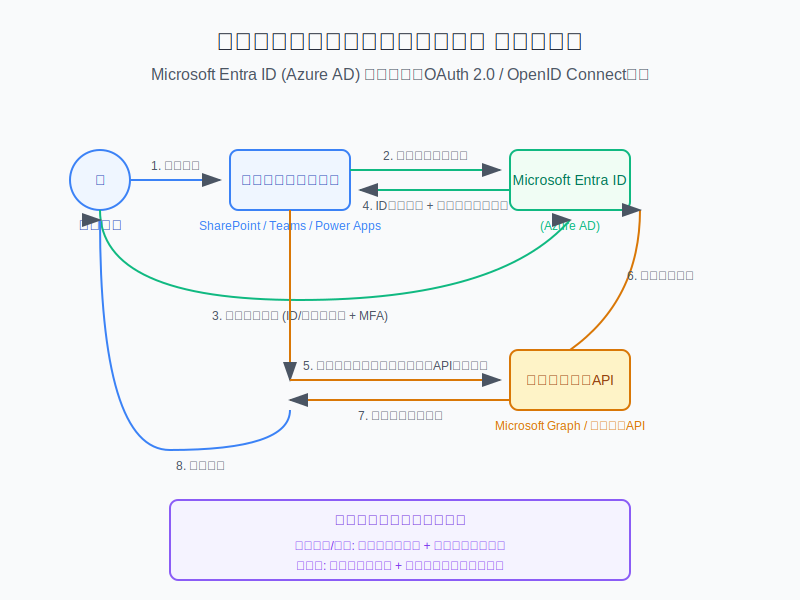
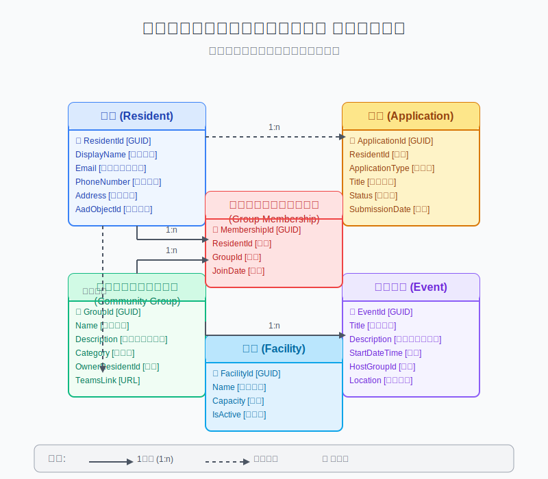

# グローバル・ハーモニー・シティ 技術設計ドキュメント

**文書バージョン**: 1.0.0  
**最終更新日**: 2025年5月18日  
**作成者**: Claude & 技術責任者

## 目次

1. [はじめに](#はじめに)
2. [システム概要](#システム概要)
3. [アーキテクチャ設計](#アーキテクチャ設計)
4. [コンポーネント詳細](#コンポーネント詳細)
5. [データモデル](#データモデル)
6. [セキュリティ設計](#セキュリティ設計)
7. [拡張性と将来計画](#拡張性と将来計画)
8. [開発・運用ガイドライン](#開発運用ガイドライン)
9. [付録](#付録)

## はじめに

### 目的

このドキュメントは、グローバル・ハーモニー・シティのITシステム構築に関する技術設計を詳細に記述するものです。少人数チーム（初期は2名体制）での効率的な開発と、段階的な拡張を可能にするシステムアーキテクチャの設計指針を提供します。

### 参照ドキュメント

- グローバル・ハーモニー・シティ構想完全ガイド
- グローバル・ハーモニー・シティ - 最小機能構成
- Microsoft 365開発者ドキュメント
- Power Platform実装ガイド

### 設計原則

1. **人間中心設計**: すべての技術選択は、エンドユーザー（住民と職員）の体験を優先
2. **スケーラビリティ**: 初期は小規模でも、段階的な成長に柔軟に対応できる設計
3. **コスト効率性**: 限られたリソースで最大限の価値を提供
4. **標準技術の活用**: カスタム開発を最小限に抑え、標準的なクラウドサービスを最大限活用
5. **セキュリティバイデザイン**: 設計段階からセキュリティを組み込む
6. **メンテナンス容易性**: 少人数チームでも維持管理可能なシステム

## システム概要

### 対象ユーザー

1. **住民**: 自治体サービスの利用者（1,200名を想定）
2. **自治体職員**: システム管理者および業務担当者（初期は15〜20名）
3. **コミュニティリーダー**: 住民グループのファシリテーター（10〜15名）
4. **ビジターおよび潜在的住民**: 自治体情報の閲覧者

### 主要機能

1. **情報提供・広報**
   - ニュース・お知らせ配信
   - イベント情報管理
   - 自治体計画・資料公開

2. **住民サービス**
   - 各種申請・手続き
   - 施設・設備予約
   - 相談受付・問い合わせ管理

3. **コミュニティ活動支援**
   - グループ活動管理
   - ボランティア募集・マッチング
   - 共創プロジェクト支援

4. **行政運営**
   - 業務ワークフロー自動化
   - データ分析・可視化
   - 資源管理・最適化

### 非機能要件

1. **パフォーマンス**
   - ページロード時間: 3秒以内
   - トランザクション応答時間: 5秒以内
   - 最大同時ユーザー: 初期100名→段階的に1,000名

2. **可用性**
   - 稼働率: 99.9%（月間のダウンタイム約45分以内）
   - メンテナンス時間: 毎月第2日曜日 23:00-25:00（事前通知）

3. **拡張性**
   - ユーザー数: 最大30,000名までのスケール
   - データ量: 年間10TBの増加に対応

4. **セキュリティ**
   - 日本の個人情報保護法への準拠
   - 多要素認証によるアクセス保護
   - 暗号化（保存時および転送時）

## アーキテクチャ設計

### 全体アーキテクチャ

システムは、以下の5つの層で構成されています：

1. **住民タッチポイント層**: エンドユーザーとのインターフェース
2. **フロントエンド層**: ユーザーインターフェースの実装
3. **アプリケーション層**: ビジネスロジックと機能実装
4. **データ層**: データの保存と管理
5. **インフラ層**: システム基盤と運用環境

各層の関係は以下の図の通りです：

### クラウドサービス活用戦略

Microsoft 365およびMicrosoft Azureを中心とした構成を採用し、SaaSおよびPaaSサービスを最大限活用します。

1. **Microsoft 365**: 
   - SharePoint Online
   - Microsoft Teams
   - Exchange Online
   - Microsoft Stream
   - OneDrive for Business

2. **Power Platform**:
   - Power Apps
   - Power Automate
   - Power BI
   - Dataverse

3. **Microsoft Azure**:
   - Azure Functions
   - Azure Logic Apps
   - Azure SQL Database
   - Azure Storage
   - Azure Active Directory

### 認証・認可フロー

1. ユーザーは Microsoft Entra ID (旧 Azure AD) を使用して認証
2. OAuth 2.0 / OpenID Connect プロトコルによる安全なアクセストークン発行
3. 条件付きアクセスポリシーによる多層防御
4. アプリケーションレベルでの権限管理

## コンポーネント詳細

### 住民ポータル (SharePoint Online)

**設計概要**:
SharePoint Onlineをベースとした住民向け情報ポータル。SPFx (SharePoint Framework) を使用したカスタマイズで、使いやすく魅力的なユーザーインターフェースを提供します。

**主要機能**:
- ニュース・お知らせ配信
- イベントカレンダー
- 資料・申請書ライブラリ
- 部署・施設情報

**技術仕様**:
- SPFx Webパーツによるカスタムコンポーネント
- レスポンシブデザイン（モバイル対応）
- 多言語対応（日本語、英語）
- Microsoft Graph API連携

**実装計画**:
1. サイトコレクション設計
2. 情報アーキテクチャ構築
3. カスタムSPFx Webパーツ開発
4. ナビゲーション・UX設計

### 住民アプリ (Power Apps)

**設計概要**:
Power Appsを使用したクロスプラットフォームモバイルアプリケーション。住民が自治体サービスに簡単にアクセスできる窓口として機能します。

**主要機能**:
- 各種申請・手続き（オンラインフォーム）
- 施設予約システム
- お知らせ・通知表示
- マイページ（個人情報・履歴管理）

**技術仕様**:
- Canvas App（デザイン重視のアプローチ）
- Dataverseとの連携
- オフライン機能の部分的サポート
- プッシュ通知対応

**実装計画**:
1. UI/UXデザイン
2. 基本画面構築
3. データ連携設定
4. ワークフロー連携

### コミュニティハブ (Microsoft Teams)

**設計概要**:
Microsoft Teamsを活用した住民コミュニティプラットフォーム。各種グループ活動やプロジェクトのコラボレーション基盤として機能します。

**主要機能**:
- グループチャット・ディスカッション
- ファイル共有・共同編集
- オンラインミーティング
- タスク管理・カレンダー共有

**技術仕様**:
- Teamsチーム・チャネル構造
- ゲストアクセス管理
- カスタムタブアプリ統合
- ボット連携（質問回答）

**実装計画**:
1. チーム構造設計
2. テンプレート作成
3. ポリシー・ガバナンス設定
4. カスタムアプリ統合

### 業務自動化 (Power Automate)

**設計概要**:
Power Automateを活用した業務プロセスの自動化。申請処理や通知など、定型業務の効率化を実現します。

**主要ワークフロー**:
- 申請受付・承認フロー
- 通知自動送信
- 定期レポート生成
- データ同期処理

**技術仕様**:
- クラウドフロー
- スケジュールトリガー
- 条件分岐・並列処理
- エラーハンドリング

**実装計画**:
1. 業務プロセス分析
2. フロー設計
3. コネクタ設定
4. テスト・最適化

### データ管理 (Dataverse / SharePoint)

**設計概要**:
Microsoft Dataverseと SharePoint リストを組み合わせたデータ管理基盤。構造化データと非構造化データを適切に管理します。

**データ分類**:
- マスターデータ: Dataverse（住民情報、施設情報など）
- トランザクションデータ: Dataverse（申請、予約など）
- コンテンツデータ: SharePoint（ドキュメント、メディア）
- 分析データ: Power BI データセット

**技術仕様**:
- エンティティリレーションシップ設計
- ビジネスルール実装
- セキュリティモデル（行レベルセキュリティ）
- データ統合・同期方法

**実装計画**:
1. データモデル設計
2. エンティティ作成
3. セキュリティロール設定
4. 初期データ移行

## データモデル

### 主要エンティティ

#### 住民エンティティ

| フィールド名 | データ型 | 説明 |
|----------|--------|------|
| ResidentId | GUID (主キー) | 住民固有ID |
| DisplayName | テキスト | 表示名 |
| Email | メールアドレス | メールアドレス |
| PhoneNumber | 電話番号 | 連絡先電話番号 |
| Address | テキスト | 住所 |
| RegistrationDate | 日時 | 登録日 |
| PreferredLanguage | 選択肢 | 希望言語 |
| NotificationPreferences | 複数選択 | 通知設定 |
| AadObjectId | テキスト | Azure AD参照ID |

#### 申請エンティティ

| フィールド名 | データ型 | 説明 |
|----------|--------|------|
| ApplicationId | GUID (主キー) | 申請固有ID |
| ResidentId | 参照 | 申請者（住民テーブル参照） |
| ApplicationType | 選択肢 | 申請種別 |
| Title | テキスト | 件名 |
| Description | 複数行テキスト | 内容 |
| SubmissionDate | 日時 | 提出日時 |
| Status | 選択肢 | 状態（提出/審査中/完了/却下） |
| AssignedTo | 参照 | 担当者 |
| DueDate | 日時 | 期限 |
| Attachments | ファイル | 添付ファイル |

#### コミュニティグループエンティティ

| フィールド名 | データ型 | 説明 |
|----------|--------|------|
| GroupId | GUID (主キー) | グループ固有ID |
| Name | テキスト | グループ名 |
| Description | 複数行テキスト | 説明 |
| Category | 選択肢 | カテゴリ |
| CreationDate | 日時 | 作成日 |
| OwnerResidentId | 参照 | オーナー（住民テーブル参照） |
| MemberCount | 数値 | メンバー数 |
| IsActive | 真偽値 | アクティブ状態 |
| TeamsLink | URL | Teamsチームリンク |

### リレーションシップ

1. **住民 - 申請**: 1対多（1人の住民が複数の申請を持つ）
2. **住民 - コミュニティグループ**: 多対多（グループメンバーシップ中間テーブル経由）
3. **コミュニティグループ - イベント**: 1対多（1グループが複数のイベントを持つ）

### データアクセスパターン

1. **管理者ビュー**: 全データへのアクセス（管理用途）
2. **職員ビュー**: 担当業務関連データへのアクセス
3. **住民ビュー**: 自身のデータ + 公開データへのアクセス
4. **ゲストビュー**: 公開データのみアクセス可能

## セキュリティ設計

### ID・アクセス管理

1. **認証基盤**: 
   - Microsoft Entra ID (Azure AD)をアイデンティティプロバイダーとして使用
   - 外部ユーザー認証にEntra ID B2C (Azure AD B2C)を検討（将来拡張）

2. **認証方法**:
   - 管理者/職員: 多要素認証（MFA）必須
   - 住民: パスワード + 条件付きMFA
   - アプリ間: サービスプリンシパル/マネージドID

3. **アクセス制御**:
   - ロールベースアクセス制御（RBAC）
   - 属性ベースアクセス制御（ABAC）
   - 条件付きアクセスポリシー

### データセキュリティ

1. **保存時の暗号化**:
   - Dataverse: 既定で保存時暗号化
   - SharePoint: 保存時暗号化
   - カスタムデータ: Azure Storage暗号化

2. **転送時の暗号化**:
   - TLS 1.3による通信暗号化
   - APIキー管理（Azure Key Vault）

3. **データ分類**:
   - 公開情報
   - 内部情報
   - 機密情報（個人データ）
   - 高機密情報（特定の個人情報）

4. **データ保護機能**:
   - Microsoft Purview情報保護
   - データ損失防止（DLP）ポリシー

### コンプライアンス

1. **個人情報保護法対応**:
   - 個人データの収集目的明示
   - 安全管理措置の実施
   - 第三者提供制限の遵守

2. **アクセス監査とログ記録**:
   - 管理操作の監査ログ
   - エンドユーザーアクセスログ
   - インシデント対応追跡

3. **デジタルアクセシビリティ対応**:
   - JIS X 8341-3:2016準拠
   - WCAG 2.1 AAレベル対応

## 拡張性と将来計画

### 段階的拡張計画

| フェーズ | 対象期間 | 拡張内容 |
|--------|--------|---------|
| 1 | 1〜6ヶ月 | 基本機能実装、初期ユーザー対応 |
| 2 | 7〜12ヶ月 | 機能拡充、ユーザー数500名対応 |
| 3 | 13〜24ヶ月 | 高度機能追加、3,000名規模対応 |
| 4 | 25ヶ月〜 | 完全機能セット、30,000名対応 |

### 技術拡張計画

1. **フェーズ1（現在）**:
   - Microsoft 365サービス中心
   - Power Platformによる開発
   - 基本的なカスタマイズ

2. **フェーズ2**:
   - Azure PaaSサービスの部分的導入
   - AIアシスタント機能追加
   - カスタムSPFx拡張

3. **フェーズ3**:
   - サーバーレスアーキテクチャ拡張
   - 外部システム連携API
   - データ分析・予測機能

4. **フェーズ4**:
   - IoT基盤連携
   - デジタルツイン実装
   - AIによる自律運用

### 統合シナリオ

1. **他自治体システム連携**:
   - 標準APIによるデータ交換
   - 共通IDによる相互認証

2. **地域事業者連携**:
   - 地域通貨システム連携
   - 商店・サービス情報統合

3. **国内外自治体間連携**:
   - 姉妹都市との情報連携
   - グローバルコミュニティ連携

## 開発・運用ガイドライン

### 開発プロセス

1. **アジャイル開発手法**:
   - 2週間スプリント
   - 毎日15分のスタンドアップ
   - スプリントレトロスペクティブ

2. **バージョン管理**:
   - GitHub リポジトリ使用
   - ブランチ戦略: GitHub Flow
   - コミットメッセージ規約

3. **テスト戦略**:
   - コンポーネントテスト
   - 統合テスト
   - ユーザー受け入れテスト

4. **デプロイメント**:
   - 環境分離: Dev → Test → Prod
   - Power Platform ソリューション管理
   - CI/CD自動化（GitHub Actions）

### 運用管理

1. **監視計画**:
   - Microsoft 365管理センター
   - Azure Monitor 
   - Power Platform CoEキット

2. **バックアップ戦略**:
   - Dataverse: 日次自動バックアップ
   - SharePointコンテンツ: 週次バックアップ
   - カスタムバックアップ: 重要設定変更前

3. **インシデント対応**:
   - 優先度分類（P1-P4）
   - エスカレーションフロー
   - 根本原因分析（RCA）プロセス

4. **変更管理**:
   - 変更審査委員会（CAB）
   - 通常/緊急変更手順
   - ロールバック計画

## 付録

### 用語集

| 用語 | 定義 |
|-----|-----|
| SPFx | SharePoint Framework: SharePointのカスタマイズフレームワーク |
| Dataverse | Power Platformのデータストレージサービス |
| MFA | Multi-Factor Authentication（多要素認証） |
| DLP | Data Loss Prevention（データ損失防止） |
| RBAC | Role-Based Access Control（ロールベースのアクセス制御） |

### 参考リンク

- [Microsoft 365開発者ドキュメント](https://docs.microsoft.com/ja-jp/microsoft-365/developer/)
- [Power Platform ドキュメント](https://docs.microsoft.com/ja-jp/power-platform/)
- [Microsoft Azure アーキテクチャセンター](https://docs.microsoft.com/ja-jp/azure/architecture/)

### ダイアグラム一覧

1. システムアーキテクチャ図 (`./assets/architecture.svg`)
2. 認証フロー図 (`./assets/auth-flow.svg`)
3. エンティティリレーションシップ図 (`./assets/entity-relationships.svg`)
4. ネットワークトポロジー図 (`./assets/network-topology.svg`)
5. デプロイメントモデル図 (`./assets/deployment-model.svg`)

---

**注**: このドキュメントは段階的に更新されます。最新バージョンはGitHubリポジトリで確認してください。
